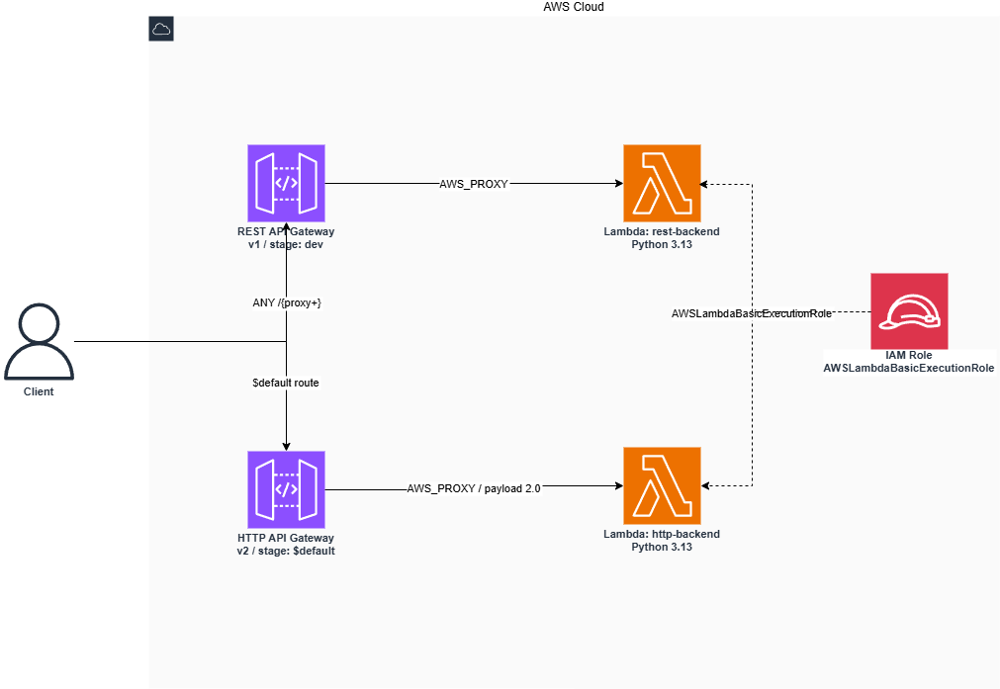

# aws-apigw-rest-vs-http-sandbox

AWS API Gateway の REST API (v1) と HTTP API (v2) をレイテンシと CloudWatch メトリクス仕様の観点で比較するための PoC リポジトリ。

## このリポジトリで行うこと

AWS API Gateway の **REST API (v1)** と **HTTP API (v2)** をそれぞれ独立した Lambda バックエンドに接続し、以下の 2 点を実測・比較する PoC。

1. **レイテンシ差の検証** — `curl` による繰り返しリクエストと CloudWatch の `Latency` / `IntegrationLatency` メトリクスを用いて、ゲートウェイオーバーヘッド（Latency − IntegrationLatency）が REST > HTTP になることを確認する。

2. **CloudWatch メトリクス仕様差の把握** — メトリクス名・ディメンションキーが REST と HTTP で異なる（例: `4XXError` vs `4xx`、ディメンション `ApiName` vs `ApiId`）ため、REST → HTTP 移行時に既存アラームが無効化される落とし穴を再現し、移行時の注意点を整理する。

## アーキテクチャ

構成図: 

<!-- draw.io ファイルを GitHub / VS Code の draw.io 拡張で開いて確認してください -->

## リソース作成手順

### 前提条件

- Terraform >= 1.10
- AWS CLI が設定済みであること（`aws configure` または環境変数）

### 1. 変数ファイルの準備

```bash
cp terraform/terraform.tfvars.example terraform/terraform.tfvars
```

`terraform/terraform.tfvars` を編集して以下の変数を設定する。

| 変数名 | 型 | 説明 | サンプル値 |
| --- | --- | --- | --- |
| `aws_region` | `string` | リソースをデプロイする AWS リージョン | `ap-northeast-1` |
| `project_name` | `string` | リソース名・タグのプレフィックス | `apigw-compare` |

### 2. 初期化

```bash
cd terraform
terraform init
```

### 3. 実行計画の確認

```bash
terraform plan
```

### 4. リソースの作成

```bash
terraform apply
```

適用後、以下の出力値が表示される。

| 出力名 | 説明 |
| --- | --- |
| `rest_api_url` | REST API (v1) のエンドポイント URL（レイテンシ計測用） |
| `http_api_url` | HTTP API (v2) のエンドポイント URL（レイテンシ計測用） |

### 5. レイテンシ計測

`terraform output` でエンドポイント URL を取得し、`curl` で比較計測する。

```bash
REST_URL=$(terraform output -raw rest_api_url)
HTTP_URL=$(terraform output -raw http_api_url)

# 各 API を 10 回リクエストして応答時間を記録
for i in $(seq 10); do curl -o /dev/null -s -w "%{time_total}\n" "$REST_URL"; done
for i in $(seq 10); do curl -o /dev/null -s -w "%{time_total}\n" "$HTTP_URL"; done
```

CloudWatch コンソールで `Latency` と `IntegrationLatency` を並べて確認し、差分（＝ゲートウェイオーバーヘッド）が REST > HTTP になることを検証する。

| CloudWatch メトリクス | REST API | HTTP API |
| --- | --- | --- |
| クライアントエラー | `4XXError` | `4xx` |
| サーバーエラー | `5XXError` | `5xx` |
| 主ディメンション | `ApiName` | `ApiId` |

> REST → HTTP 移行時にアラームが無反応になる典型的な落とし穴。既存のアラームはそのまま流用不可。

### 6. リソースの削除

```bash
terraform destroy
```

## 計測結果

### curl レイテンシ（クライアント側 RTT 込み）

各エンドポイントに 10 回リクエストを送信した結果（単位: 秒）。

| | 1 回目（コールドスタート） | 2〜10 回目 平均 | 2〜10 回目 最小 | 2〜10 回目 最大 |
| --- | ---: | ---: | ---: | ---: |
| **REST API** | 115.8 ms | 79.5 ms | 68.4 ms | 88.5 ms |
| **HTTP API** | 75.2 ms | 44.7 ms | 38.4 ms | 53.0 ms |

#### REST API（生データ）

```text
0.115844
0.086671
0.083419
0.088483
0.073779
0.086172
0.070099
0.076194
0.068408
0.082122
```

#### HTTP API（生データ）

```text
0.075169
0.040231
0.039980
0.051038
0.048771
0.052970
0.038358
0.045743
0.043302
0.042301
```

#### CloudWatch メトリクス比較

単位: ms。両 API はそれぞれ独立した Lambda 関数を使用しているが、同一コードをデプロイしているため、`Latency` の差がそのままゲートウェイアーキテクチャの差を示す。

| API タイプ | Latency | IntegrationLatency |
| --- | ---: | ---: |
| REST API | 30.86 ms | 27.3 ms |
| HTTP API | 3.8 ms | — （ウォーム時にサブミリ秒となりメトリクス未発行） |

> HTTP API の IntegrationLatency はウォーム Lambda がサブミリ秒で完了するため CloudWatch に発行されない。`GW overhead = Latency − IntegrationLatency` での比較は成立しないが、**Latency の直接比較**（30.86 ms vs 3.8 ms）がゲートウェイ速度差の証拠として十分機能する。


### 考察

- **コールドスタート時（curl 1 回目）** は REST API が約 1.5 倍遅い（115.8 ms vs 75.2 ms）。Lambda を API ごとに分離し独立した初期状態で計測した結果、HTTP API のコールドスタートが速いという期待通りの傾向が得られた。
- **ウォームリクエスト時（curl 2〜10 回目）** は REST API が約 1.8 倍遅い（79.5 ms vs 44.7 ms）。HTTP API の軽量なアーキテクチャによるゲートウェイオーバーヘッドの差が curl レベルでも一貫して観測できる。
- **CloudWatch Latency** は REST API が約 8.1 倍大きい（30.86 ms vs 3.8 ms）。HTTP API の IntegrationLatency はウォーム時にサブミリ秒となりメトリクスが欠落するため `GW overhead = Latency − IntegrationLatency` での比較は成立しない。それぞれ独立した Lambda 関数だが同一コードをデプロイしているため、Latency の直接比較がゲートウェイ速度差の証拠として機能する。
- **Lambda の分離が比較の前提条件** であることが今回の計測で判明した。同一 Lambda を共有すると REST 計測が HTTP 計測のウォームアップになり、コールドスタートおよび IntegrationLatency の比較が成立しない。

